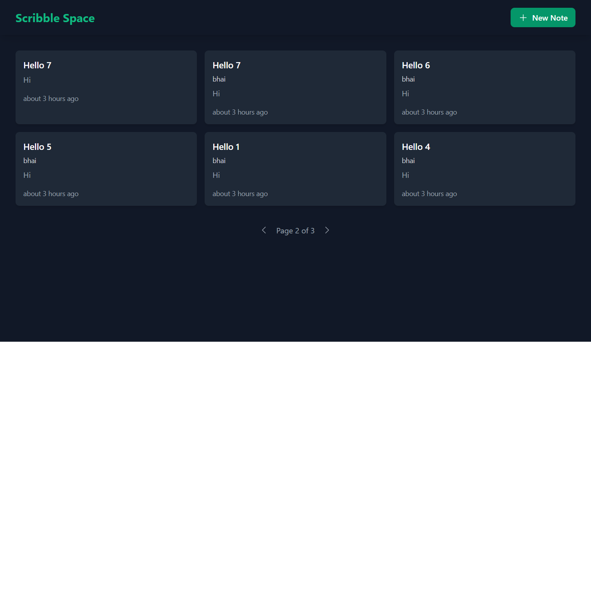

# Scribble Space 📝

A modern, responsive note-taking application built with React and TailwindCSS. Scribble Space provides a clean and intuitive interface for creating, managing, and organizing your notes with features like note pinning, pagination, and real-time updates.



## 🌟 Features

- **Create & Edit Notes**

  - Add title, tagline, and body content
  - Real-time preview
  - Modal-based editing interface
  - Form validation

- **Note Management**

  - Pin important notes to top
  - Delete unwanted notes
  - Edit existing notes
  - Preview note content in cards

- **Modern UI/UX**

  - Clean, dark theme with green accents
  - Responsive design across all devices
  - Grid layout for notes
  - Hover effects and smooth transitions
  - Toast notifications for actions

- **User Experience**

  - Pagination (6 notes per page)
  - Time-ago timestamps
  - Empty state handling
  - Accessible interface with ARIA labels
  - Keyboard navigation support

- **Data Persistence**
  - Local storage integration
  - No sign-in required
  - Multi-user support

## 🛠️ Tech Stack

- **Frontend Framework**: React.js
- **Styling**: TailwindCSS
- **State Management**: React Hooks
- **Storage**: Local Storage API
- **Build Tool**: Vite

### Libraries Used

- `@heroicons/react` - UI icons
- `react-icons` - Additional icons
- `react-toastify` - Toast notifications
- `date-fns` - Date formatting
- Custom hooks for notes and pagination

## 🚀 Live Demo

Check out the live demo: [Scribble Space Demo](https://your-demo-link.com)

## 📂 Project Structure

```
scribble-space/
├── public/
│   ├── favicon.ico
│   ├── index.html
│   ├── manifest.json
│   ├── og-image.png
│   └── robots.txt
│
├── src/
│   ├── components/
│   │   ├── EmptyState.jsx      # Empty state view component
│   │   ├── Header.jsx          # App header with title and actions
│   │   ├── NoteCard.jsx        # Individual note display component
│   │   ├── NoteGrid.jsx        # Grid layout for notes
│   │   ├── NoteModal.jsx       # Modal for create/edit notes
│   │   └── Pagination.jsx      # Custom pagination component
│   │
│   ├── hooks/
│   │   ├── useNotes.js         # Custom hook for note operations
│   │   └── usePagination.js    # Custom hook for pagination logic
│   │
│   ├── utils/
│   │   ├── constants.js        # App-wide constants
│   │   └── helpers.js          # Utility functions
│   │
│   ├── App.jsx                 # Main app component
│   ├── index.css               # Global styles
│   └── index.js                # App entry point
│
├── .gitignore
├── package.json
├── README.md
└── tailwind.config.js          # Tailwind configuration
```

### Key Directories and Files

- **/public**: Static assets and HTML template
- **/src/components**: Reusable React components
- **/src/hooks**: Custom React hooks for state and logic
- **/src/utils**: Helper functions and constants
- **tailwind.config.js**: TailwindCSS customization
- **index.css**: Global styles and Tailwind directives

## 💻 Installation & Setup

1. Clone the repository:

```bash
git clone https://github.com/KeepSerene/scribble-space-crud-note-keeper
```

2. Navigate to project directory:

```bash
cd scribble-space
```

3. Install dependencies:

```bash
npm install
```

4. Start development server:

```bash
npm start
```

## 🔧 How It Works

### Local Storage

The app uses browser's Local Storage for data persistence:

- Notes are stored as JSON strings
- Data structure includes: title, tagline, body, creation date, update date, and pin status
- Auto-saves on all CRUD operations

### Note Structure

```javascript
{
  id: string,
  title: string,
  tagline: string,
  body: string,
  createdAt: ISOString,
  updatedAt: ISOString,
  isPinned: boolean
}
```

### Pagination

- Custom hook implementation
- 6 notes per page
- Maintains state across note operations
- Responsive across different screen sizes

## 🤝 Contributing

Contributions are welcome! Please feel free to submit a Pull Request.

1. Fork the repository
2. Create your feature branch (`git checkout -b feature/AmazingFeature`)
3. Commit your changes (`git commit -m 'Add some AmazingFeature'`)
4. Push to the branch (`git push origin feature/AmazingFeature`)
5. Open a Pull Request

## 📝 License

This project is licensed under the MIT License - see the [LICENSE](LICENSE) file for details.

## 👤 Author

Dhrubajyoti Bhattacharjee

- GitHub: [@KeepSerene](https://github.com/KeepSerene)
- LinkedIn: [Dhrubajyoti Bhattacharjee](https://www.linkedin.com/in/dhrubajyoti-bhattacharjee-320822318/)

## 🙏 Acknowledgments

- Inspired by Google Keep
- Icons from Heroicons and React Icons
- TailwindCSS for styling system

## 📈 Future Improvements

- [ ] Note categories/labels
- [ ] Search functionality
- [ ] Dark/Light theme toggle
- [ ] Cloud sync support
- [ ] Rich text editor
- [ ] Image attachments
- [ ] Collaborative notes
- [ ] Export/Import notes

---

⭐️ If you found this project helpful, please give it a star!
